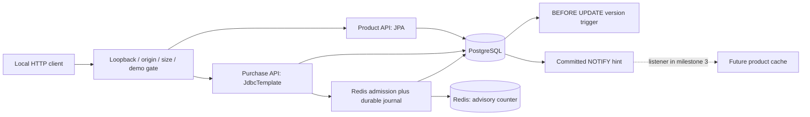
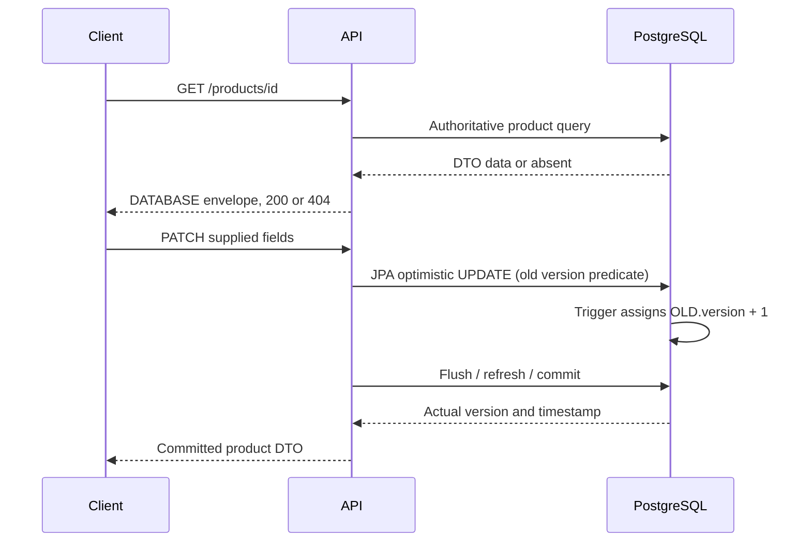
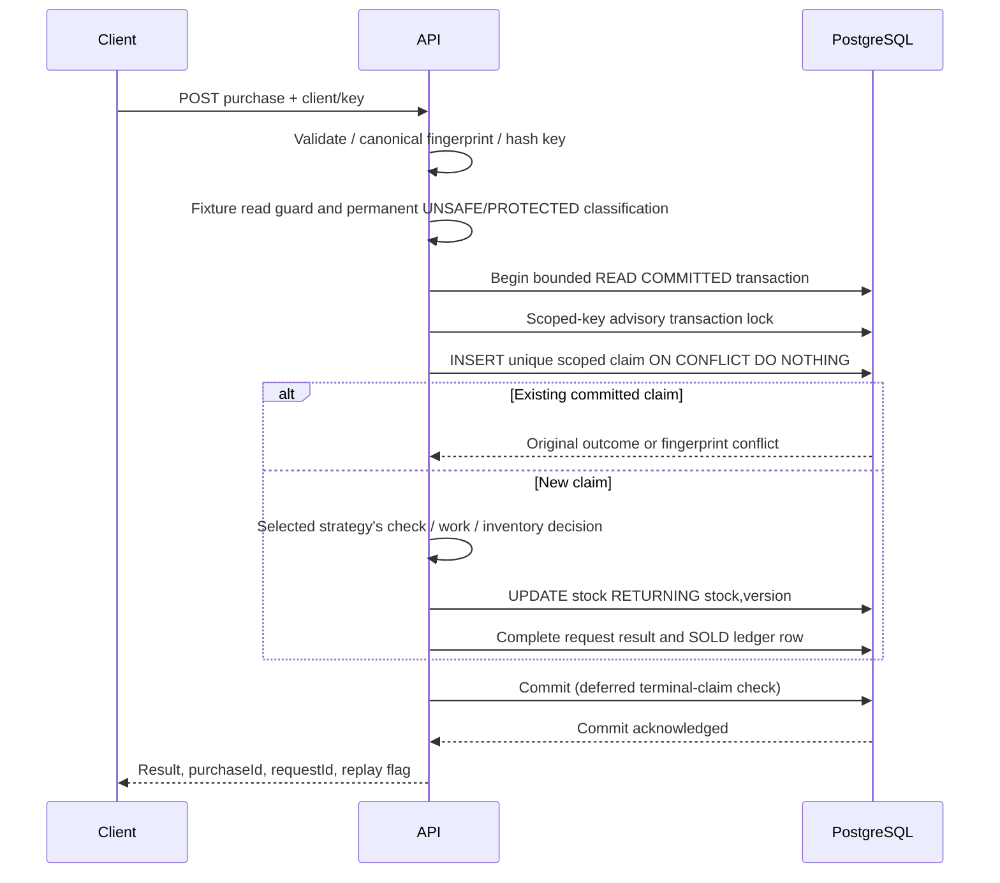
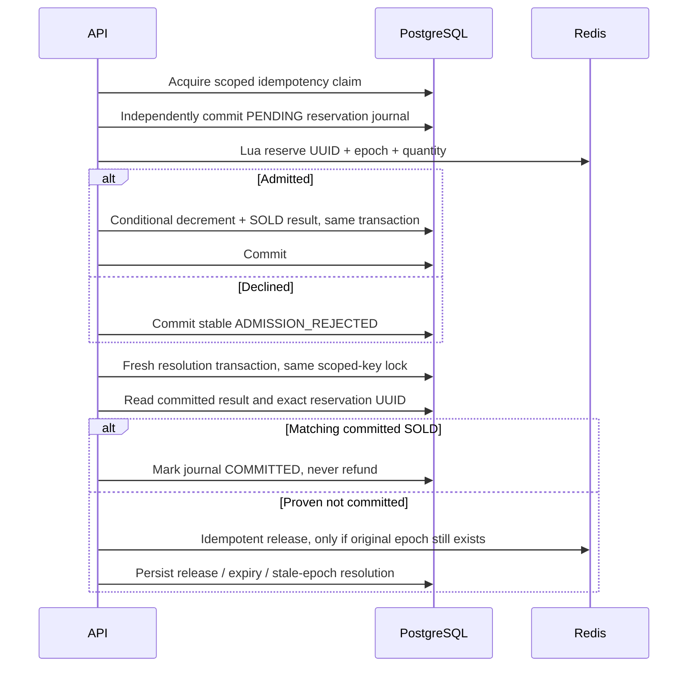

# Architecture: delivered slice and future boundaries

**One host application instance, one dedicated PostgreSQL database, one Redis
service.** Milestone 2 implements five purchase strategies, one durable ledger/
idempotency boundary and advisory Redis admission. Product reads still query
PostgreSQL directly; the cache/listener/breakers arrive in milestone 3.

## Product path

The trigger overrides proposed version values for **all ordinary SQL updates**,
including JDBC and external SQL. Hibernate's proposed +1 agrees with the trigger;
it is not an additional increment. An external SQL update makes an already-loaded
JPA version stale. There is no auto-DDL mutation, production inventory CHECK, or
reseed-on-startup. Public mutations validate nonnegative starting/reset stock.

## Purchase boundary

The `purchase_ledger` view selects SOLD rows from `purchase_requests`. This
single-table boundary avoids independently updating request and ledger copies.
A uniqueness constraint prevents duplicate claims. Claim contention waits for
the transaction, not an application-memory map. Failed transactions remove the
claim and inventory change together. Unknown commit outcomes return a retryable
error; repeating the same scoped key resolves what actually committed.

PESSIMISTIC locks the product before checking stock. OPTIMISTIC's version conflict
rolls back the entire attempt before a fresh transaction reacquires the claim;
the twentieth failed conditional update persists GAVE_UP. NONE deliberately
checks without a product lock then decrements without a stock predicate. Its
fixture classification commits **before** this work, so it does not accidentally
serialize the unsafe race. ATOMIC_SQL remains the default baseline.

## Redis admission and reconciliation

If DB resolution is unavailable or the original transaction cannot yet be
fenced, leave PENDING. Only drained reconciliation may rebuild the counter from
locked DB stock with a fresh epoch. Startup, outside writes and other strategies
distrust the advisory epoch. The bounded local fixture guard covers API admin
transactions through commit; it is not multi-instance orchestration. See
[stock-admission.md](stock-admission.md) for Lua states and drift limitations.

## Later cache/recovery work (not implemented yet)

Milestone 3 will insert typed cache lookups before product queries, keep purchase
decisions in PostgreSQL, invalidate after commit, and use a dedicated LISTEN
connection plus generation/epoch fencing. Recovery must rotate the epoch and
verify listener/Redis health **before** enabling cache readiness. A CLOSED
breaker alone will not imply safe cache data. These are roadmap requirements,
not current capabilities.

## Feature-to-code map

| Delivered feature | Code |
|---|---|
| Boot/toolchain/dependencies | `build.gradle`, `gradle/wrapper`, `gradle.lockfile` |
| Bounded defaults/profiles | `src/main/resources/application*.yml` |
| Product schema, version and committed notifications | `db/migration/V1__authoritative_products.sql` |
| Request uniqueness and terminal ledger | `db/migration/V2__purchase_requests_and_ledger.sql` |
| Product DTOs, validation, optimistic CRUD | `product/` |
| Shared five-strategy purchase/replay boundary | `purchase/PurchaseService.java`, `InventoryStrategies.java` |
| Unsafe fixture isolation and local drain guard | `purchase/PurchaseFixturePolicy.java`, `FixtureActivity.java` |
| Advisory Redis gate, journal and reconciliation | `purchase/StockAdmissionService.java`, `RedisStockClient.java`, `redis/*.lua`, migration V5 |
| Canonical identity/fingerprint | `purchase/PurchaseRequest.java` |
| Request safety, tracing and error mapping | `web/` |
| Database/HTTP concurrency and rollback evidence | `MilestoneOneAcceptanceTest.java` |
| Protected/unsafe race evidence | `PurchaseStrategiesAcceptanceTest.java` |
| Lua, actual Redis outage, epoch and compensation evidence | `RedisAdmissionAcceptanceTest.java` |
| Forced Java process death before/after commit | `PurchaseCrashAcceptanceTest.java`, test-only `PurchaseCrashChild.java` |
| Upgrade/restart and default read-only mode | `StartupAcceptanceTest.java` |
| PowerShell-first operation | `scripts/` |

Java package paths above are relative to
`src/main/java/com/example/cacheaside`; SQL paths are relative to
`src/main/resources`. Integration suites are under `src/integrationTest`.
