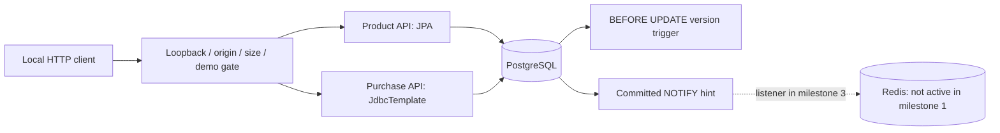
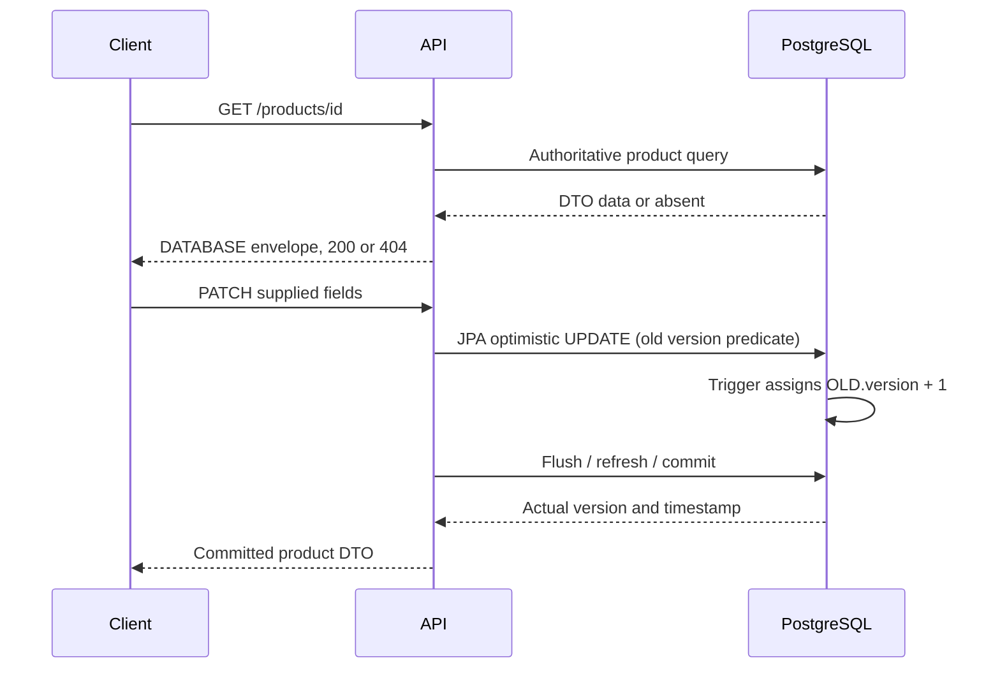
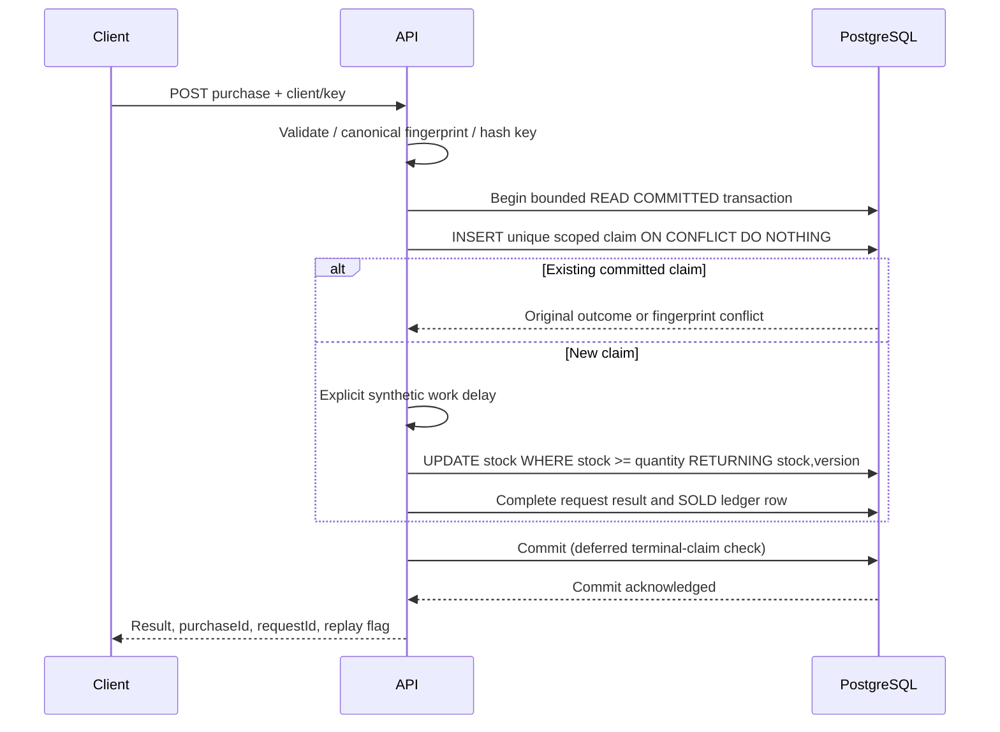

# Architecture: delivered slice and future boundaries

**One host application instance, one dedicated PostgreSQL database, one Redis
service.** Milestone 1 implements only the database-backed vertical slice.
Redis is configured in Compose but is not consulted by the current API.

## Product path

The trigger overrides proposed version values for **all ordinary SQL updates**,
including JDBC and external SQL. Hibernate's proposed +1 agrees with the trigger;
it is not an additional increment. An external SQL update makes an already-loaded
JPA version stale. There is no auto-DDL mutation, production inventory CHECK, or
reseed-on-startup. Public mutations validate nonnegative starting/reset stock.

## Purchase boundary

The `purchase_ledger` view selects SOLD rows from `purchase_requests`. This
single-table boundary avoids independently updating request and ledger copies.
A uniqueness constraint prevents duplicate claims. Claim contention waits for
the transaction, not an application-memory map. Failed transactions remove the
claim and inventory change together. Unknown commit outcomes return a retryable
error; repeating the same scoped key resolves what actually committed.

## Later cache/recovery work (not implemented yet)

Milestone 3 will insert typed cache lookups before product queries, keep purchase
decisions in PostgreSQL, invalidate after commit, and use a dedicated LISTEN
connection plus generation/epoch fencing. Recovery must rotate the epoch and
verify listener/Redis health **before** enabling cache readiness. A CLOSED
breaker alone will not imply safe cache data. These are roadmap requirements,
not current capabilities.

## Feature-to-code map

| Delivered feature | Code |
|---|---|
| Boot/toolchain/dependencies | `build.gradle`, `gradle/wrapper`, `gradle.lockfile` |
| Bounded defaults/profiles | `src/main/resources/application*.yml` |
| Product schema, version and committed notifications | `db/migration/V1__authoritative_products.sql` |
| Request uniqueness and terminal ledger | `db/migration/V2__purchase_requests_and_ledger.sql` |
| Product DTOs, validation, optimistic CRUD | `product/` |
| Atomic purchase and replay boundary | `purchase/PurchaseService.java` |
| Canonical identity/fingerprint | `purchase/PurchaseRequest.java` |
| Request safety, tracing and error mapping | `web/` |
| Database/HTTP concurrency and rollback evidence | `MilestoneOneAcceptanceTest.java` |
| Upgrade/restart and default read-only mode | `StartupAcceptanceTest.java` |
| PowerShell-first operation | `scripts/` |

Java package paths above are relative to
`src/main/java/com/example/cacheaside`; SQL paths are relative to
`src/main/resources`. Integration suites are under `src/integrationTest`.
