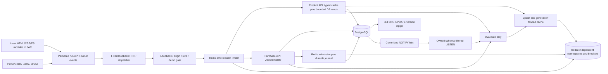
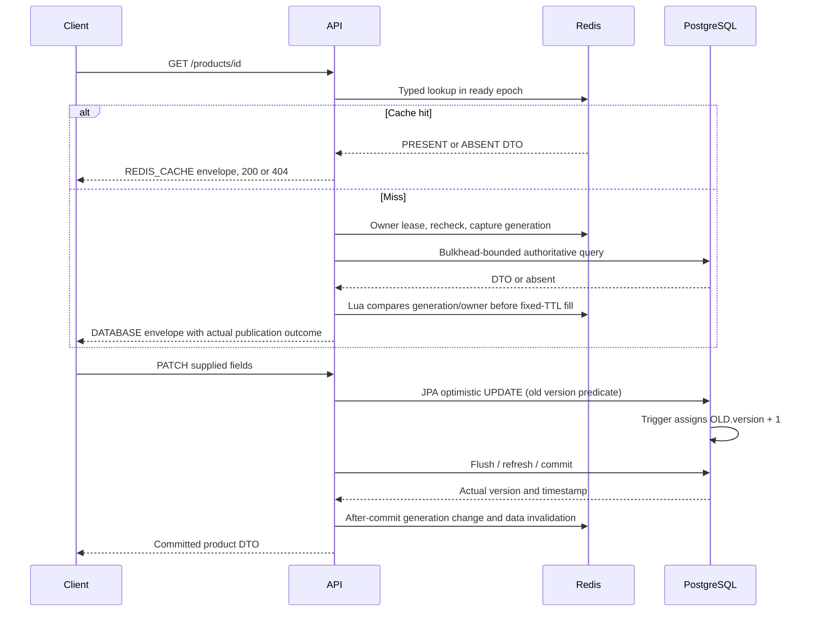
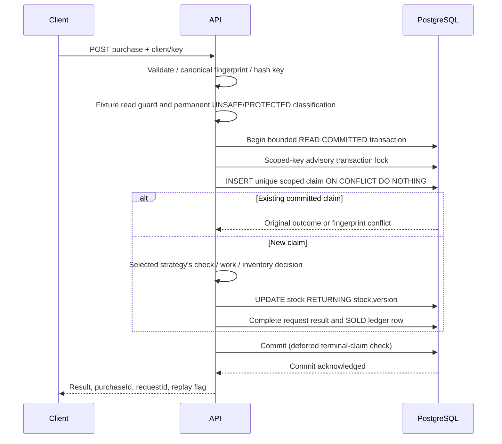
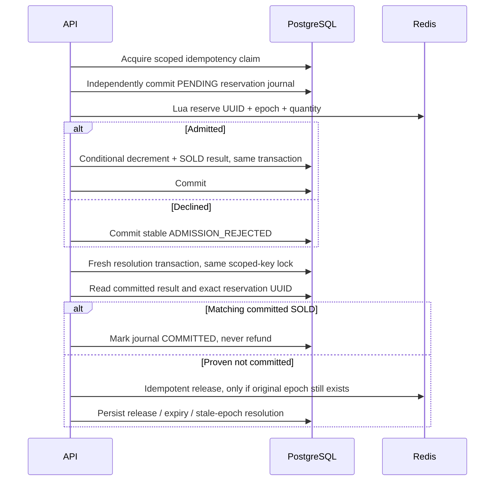
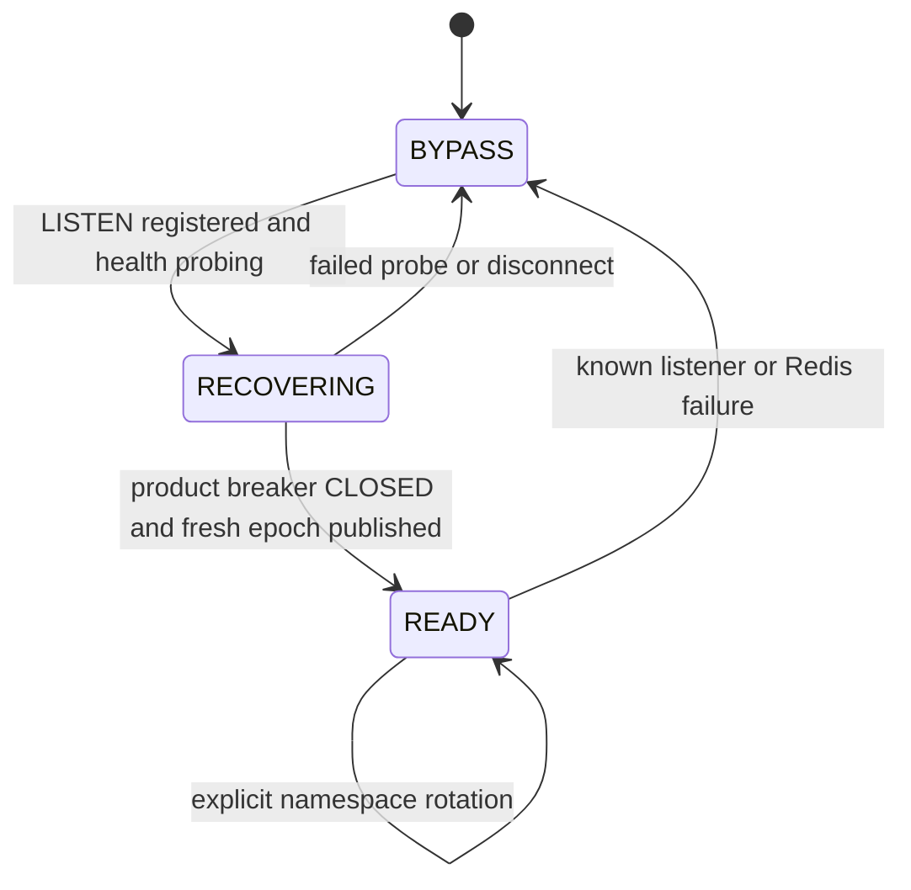
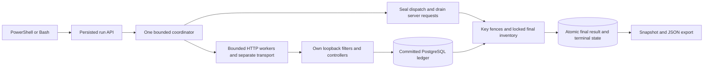
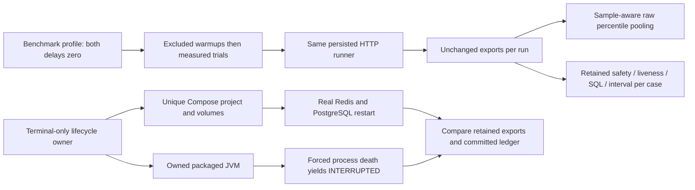

# Architecture and measured boundaries

**One host application instance, one dedicated PostgreSQL database, one Redis
service.** Milestone 6 implements five purchase strategies, one durable ledger/
idempotency boundary and advisory Redis admission, plus typed eventual caching,
coordinated listener recovery and separate Redis cache/admission/limiter breakers,
plus persisted real-HTTP experiments, their same-origin dashboard and repeatable
benchmark/lifecycle tooling. No benchmark client implements a second ledger.

The browser reads backend ledger/HTTP/SQL evidence, not a separate inventory
model. Live observations are labeled unquiesced; only durable final results
carry inventory verdicts. Polling and events are bounded (one cycle, 200 local
events), with gap and stale-connection warnings. Unknown crash metrics remain
unknown. The separate browser-test host owns real dependencies and the packaged
JAR; its fixed stdin process controls do not enter the production artifact.

## Product path

The trigger overrides proposed version values for **all ordinary SQL updates**,
including JDBC and external SQL. Hibernate's proposed +1 agrees with the trigger;
it is not an additional increment. An external SQL update makes an already-loaded
JPA version stale. There is no auto-DDL mutation, production inventory CHECK, or
reseed-on-startup. Public mutations validate nonnegative starting/reset stock.

## Purchase boundary

The `purchase_ledger` view selects SOLD rows from `purchase_requests`. This
single-table boundary avoids independently updating request and ledger copies.
A uniqueness constraint prevents duplicate claims. Claim contention waits for
the transaction, not an application-memory map. Failed transactions remove the
claim and inventory change together. Unknown commit outcomes return a retryable
error; repeating the same scoped key resolves what actually committed.

PESSIMISTIC locks the product before checking stock. OPTIMISTIC's version conflict
rolls back the entire attempt before a fresh transaction reacquires the claim;
the twentieth failed conditional update persists GAVE_UP. NONE deliberately
checks without a product lock then decrements without a stock predicate. Its
fixture classification commits **before** this work, so it does not accidentally
serialize the unsafe race. ATOMIC_SQL remains the default baseline.

## Redis admission and reconciliation

If DB resolution is unavailable or the original transaction cannot yet be
fenced, leave PENDING. Only drained reconciliation may rebuild the counter from
locked DB stock with a fresh epoch. Startup, outside writes and other strategies
distrust the advisory epoch. The bounded local fixture guard covers API admin
transactions through commit; it is not multi-instance orchestration. See
[stock-admission.md](stock-admission.md) for Lua states and drift limitations.

## Cache and recovery boundary

Only read paths fill. API mutations and newly committed SOLD results register a
shared after-commit invalidation; rollback does not invalidate. External committed
SQL changes produce schema-scoped invalidation hints over the owned JDBC listener.
It is a separate bounded connection, not a permanent Hikari checkout.

Product-cache HALF_OPEN accepts only health probes. The listener loop coordinates
recovery serially; no breaker callback calls Redis or flushes data. Limiter and
admission success cannot publish cache readiness. Old namespaces expire naturally,
including after a Redis restart that retains old data. A CLOSED breaker alone is
not freshness.

Healthy cold readers acquire/recheck a compare-token lease. Other callers wait
at most three seconds, then fall back without publishing. All DB product reads
share the eight-permit bulkhead; overload is explicit 503 even during limiter
fail-open. Leases do not guarantee one query under arbitrary delays/failures.
Generation and ownership fences instead prevent stale publication.

The independent limiter uses one Redis-time sorted-set Lua decision, retains
accepted timestamps in `(now-window, now]`, and explicitly fails open without
inventing quota. See [product-cache.md](product-cache.md) for exact contracts and
[limitations.md](limitations.md) for eventual consistency and detection gaps.

## Feature-to-code map

The run coordinator owns at most five isolated fixtures and uses separate
bounded worker/transport pools. It discovers its own loopback server port, not
a user-provided target. A process-local dispatch token binds request threads to
run ownership and MDC; it is not exposed in exports. Cancellation seals future
dispatch, drains accepted server-side work, then uses purchase-key advisory
fences and locked PostgreSQL stock for final ledger reconciliation. Run/result
completion commits atomically. Restart interrupts unfinished runs without
replaying purchases. JDBC execution instrumentation includes the dedicated
listener connection explicitly. See [experiments.md](experiments.md).

| Delivered feature | Code |
|---|---|
| Boot/toolchain/dependencies | `build.gradle`, `gradle/wrapper`, `gradle.lockfile` |
| Bounded defaults/profiles | `src/main/resources/application*.yml` |
| Product schema, version and committed notifications | `db/migration/V1__authoritative_products.sql` |
| Request uniqueness and terminal ledger | `db/migration/V2__purchase_requests_and_ledger.sql` |
| Product DTOs, validation, optimistic CRUD | `product/` |
| Shared five-strategy purchase/replay boundary | `purchase/PurchaseService.java`, `InventoryStrategies.java` |
| Unsafe fixture isolation and local drain guard | `purchase/PurchaseFixturePolicy.java`, `FixtureActivity.java` |
| Advisory Redis gate, journal and reconciliation | `purchase/StockAdmissionService.java`, `RedisStockClient.java`, `redis/*.lua`, migration V5 |
| Canonical identity/fingerprint | `purchase/PurchaseRequest.java` |
| Request safety, tracing and error mapping | `web/` |
| Typed cache, generations, owner leases and bulkhead | `cache/ProductCacheClient.java`, `ProductReadService.java`, `redis/cache-*.lua` |
| Post-commit and external-write invalidation/recovery | `cache/CacheInvalidation.java`, `DbChangeListener.java`, `CacheCoordinator.java`, migration V6 |
| Independent Redis failure domains | `cache/RedisAccess.java` |
| Redis-time quota and observable HTTP policy | `ratelimit/`, `redis/rate-window.lua` |
| Persisted bounded dispatcher and run/fixture ownership | `demo/RunEngine.java`, `RunGuard.java`, `RunRequestFilter.java`, migration V7 |
| Atomic results, bounded cursor events and ledger reconciliation | `demo/RunStore.java`, `RunAccounting.java`, migration V8 |
| Actual per-purpose JDBC work and guided stale-read pause | `demo/DatabaseWork.java`, `RunHooks.java` |
| Real runner/filter, cancellation, failure, scenario and crash evidence | `RunEngineAcceptanceTest.java`, `RunScenariosAcceptanceTest.java`, `RunCrashAcceptanceTest.java` |
| Database/HTTP concurrency and rollback evidence | `MilestoneOneAcceptanceTest.java` |
| Protected/unsafe race evidence | `PurchaseStrategiesAcceptanceTest.java` |
| Lua, actual Redis outage, epoch and compensation evidence | `RedisAdmissionAcceptanceTest.java` |
| Forced Java process death before/after commit | `PurchaseCrashAcceptanceTest.java`, test-only `PurchaseCrashChild.java` |
| Upgrade/restart and default read-only mode | `StartupAcceptanceTest.java` |
| Fenced fill, listener and actual preserved-data restart | `ProductCacheClientAcceptanceTest.java`, `CacheInvalidationAcceptanceTest.java`, `CacheResilienceAcceptanceTest.java` |
| Atomic quota, boundaries, headers and fail-open overload | `RateLimitAcceptanceTest.java` |
| PowerShell-first operation | `scripts/` |
| Same-origin dashboard, guides and bounded event rendering | `src/main/resources/static/dashboard*.js`, `index.html`, `dashboard.css` |
| Asserted API walkthrough, including PATCH/partial PUT and replay | `bruno/`, `tests/browser/bruno.spec.mjs` |
| Zero-delay repeated trials and sample-aware raw evidence | `scripts/benchmark.mjs`, `scripts/lab-client.mjs`, `tests/unit/benchmark.test.mjs` |
| Owned Compose process/dependency lifecycle and direct ledger check | `scripts/walkthrough.mjs`, `scripts/walkthrough-scenarios.mjs`, `tests/browser/lifecycle.spec.mjs` |
| Actual screenshots and benchmark presentation provenance | `tests/browser/presentation.spec.mjs`, `docs/results.md` |

Java package paths above are relative to
`src/main/java/com/example/cacheaside`; SQL paths are relative to
`src/main/resources`. Explicit `src/`, `scripts/`, `tests/`, `docs/` and `bruno/`
paths are repository-relative. Integration suites are under `src/integrationTest`.

## Benchmark and lifecycle evidence

Warmups use fresh fixtures and do not prewarm later products. Fixed strategy
order and correlated local samples remain biases; there is no averaged-percentile
or production-throughput claim. The lifecycle owner has no web control endpoint.
It stops only its generated project and child JVM and never deletes volumes.
